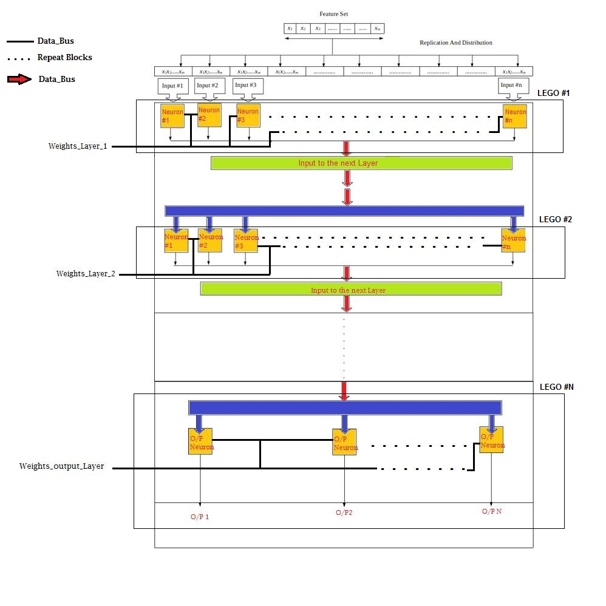

# Cadence_Design_Contest_2018
This repository contains the presentations and the code files of the product solutions developed for the Cadence Design Contest 2018. 
I had developed a conceptual design which means that the design need not be implemented on a physical chip but rather implemented on an 
FPGA and must have been thoroughly simulated along with a test plan.

For our power point presentation , please select the file with the name Cadence_Presentation[Repaired].pdf

